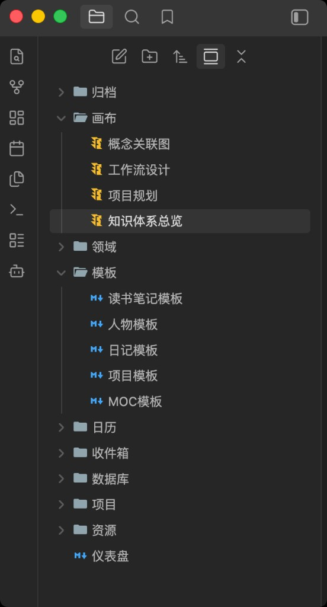
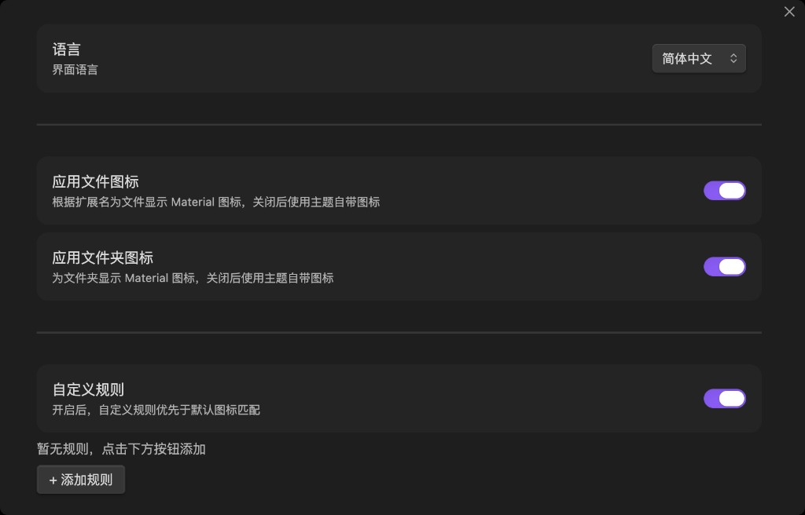
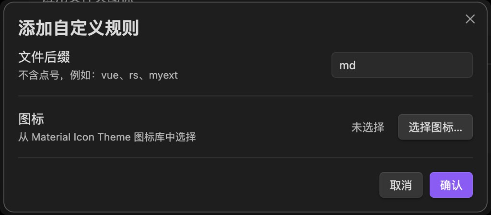
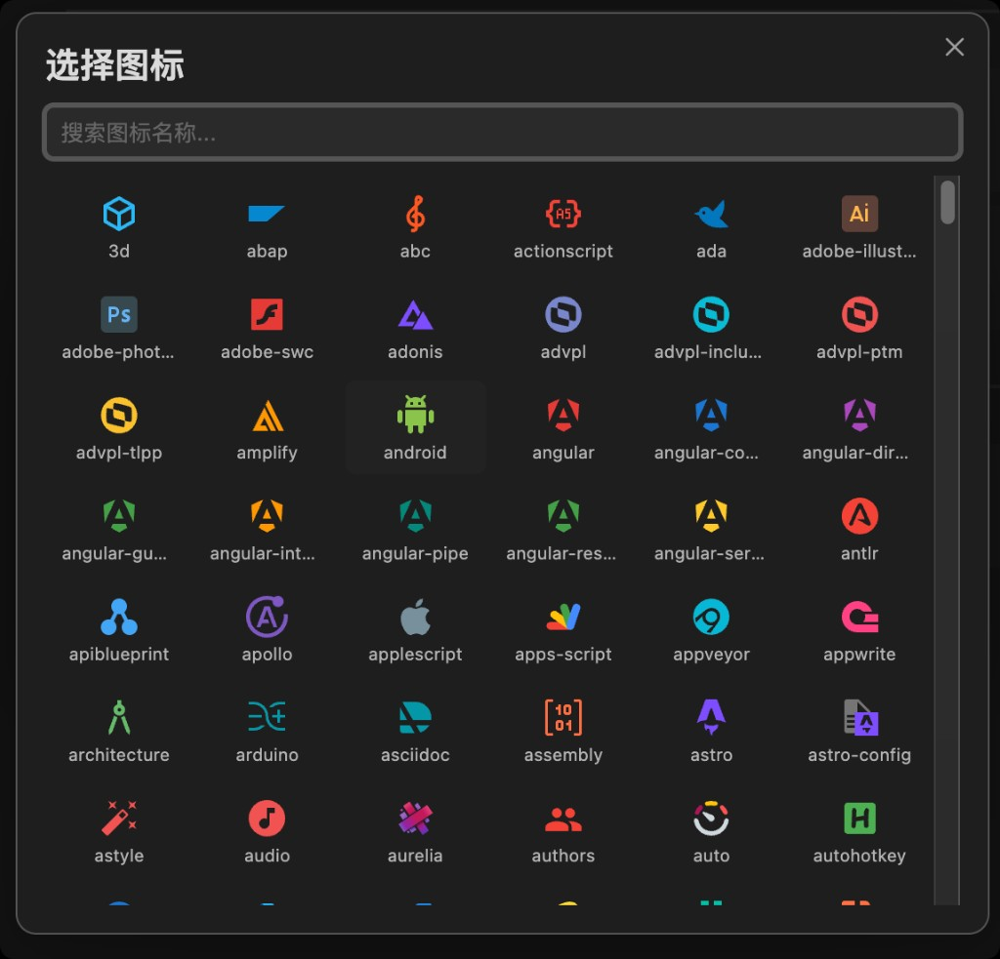

# Material File Icons for Obsidian

**English** | [简体中文](README.zh-CN.md)

Replace the default file explorer icons in Obsidian with [Material Icon Theme](https://github.com/PKief/vscode-material-icon-theme) icons, matched by file extension and filename.



## Screenshots

### File explorer

Icons are applied by extension and filename — canvas notes, Markdown templates, folders, and more each get a distinct icon (see preview above).

### Settings

Toggle file and folder icons independently, enable custom rules, and switch the settings UI language (10 languages supported).



### Custom rules

Add a rule for any extension (without the leading dot) and pick an icon from the Material Icon Theme library. Custom rules override default matching when enabled.



### Icon picker

Search and browse 500+ icons when configuring a custom rule.



## Features

- **Extension matching** — longest suffix wins (e.g. `d.ts` before `ts`)
- **Filename matching** — e.g. `.gitignore`, `Makefile`, `docker-compose.yml`
- **Folder icons** — closed / open states
- **Custom rules** — override icons per extension with a searchable icon picker
- **Toggles** — enable or disable file / folder icons independently
- **Settings UI** — English, 简体中文, 繁體中文, 日本語, 한국어, Deutsch, Français, Español, Русский, Português
- **Light & dark** — icons follow Obsidian’s theme

## Installation

### From a release (recommended)

> Release tags match `manifest.json` version exactly (e.g. `1.0.0`, not `v1.0.0`) for Obsidian community installs.

1. Download from [Releases](https://github.com/liicos/obsidian-material-icon/releases):
   - **Zip:** `material-file-icons-x.x.x.zip` — extract into `.obsidian/plugins/`
   - **Or** download `main.js`, `manifest.json`, and `styles.css` into `.obsidian/plugins/material-file-icons/` (required for Obsidian community install)
3. Enable **Material File Icons** under **Settings → Community plugins**

> **Upgrading from an older build?** The plugin id is now `material-file-icons`. Remove `.obsidian/plugins/obsidian-material-icon/` if present, then install into `material-file-icons/`.

### Manual build

```bash
git clone https://github.com/liicos/obsidian-material-icon.git
cd obsidian-material-icon
npm install
npm run build
cp main.js manifest.json styles.css /path/to/vault/.obsidian/plugins/material-file-icons/
```

## Development

```bash
npm install
npm run dev      # watch mode (does not regenerate icon data)
npm run build    # full production build
npm run build-icons   # regenerate src/icon-data.ts only
```

| Path | Purpose |
|------|---------|
| `src/main.ts` | Plugin logic |
| `scripts/build-icons.mjs` | Extract SVGs from `material-icon-theme` → `src/icon-data.ts` |
| `styles.css` | Icon and settings styles |

Do **not** edit `src/icon-data.ts` by hand. To add custom extension mappings, edit the custom block at the end of `scripts/build-icons.mjs`, then run `npm run build-icons`.

Built artifacts `main.js` and `src/icon-data.ts` are gitignored; run `npm run build` after cloning.

## Icon matching priority

1. Custom rules (when enabled)
2. Exact filename
3. Longest matching extension
4. Default file icon

## Acknowledgements

File icons are derived from [PKief/vscode-material-icon-theme](https://github.com/PKief/vscode-material-icon-theme) (MIT).

## License

[MIT](LICENSE)
